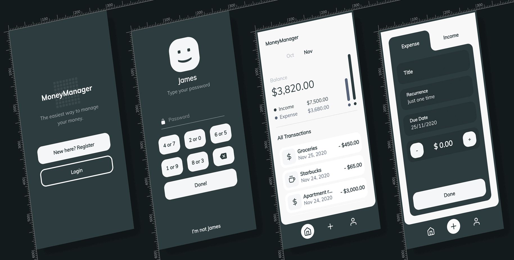

# MoneyManager

An application created with [Angular](https://angular.io/) that makes it easy for you to manage your personal finance.

## Live Demo

You can check it out [HERE](https://claudiobonfati.github.io/money-manager-app/dashboard). The project was created for learning purposes. All the data stored on its database is automatically deleted after two months.

## Project Screen Shot

## Installation and Setup Instructions

#### Example:

Clone down this repository. You will need `node` and `npm` installed globally on your machine.

Installation:

`npm install`

To Start Server:

`ng serve`  

To Visit App:

`localhost:4200`  

## Authors

* **Claudio Bonfati** - *The one who coded it* - [LinkedIn Profile](https://www.linkedin.com/in/claudiobonfati/)

* **Afip Maulana** - *The one who designed it* - [LinkedIn Profile](https://www.linkedin.com/in/afipmaulana/)

## License

This project is licensed under the [MIT License](https://choosealicense.com/licenses/mit/)
